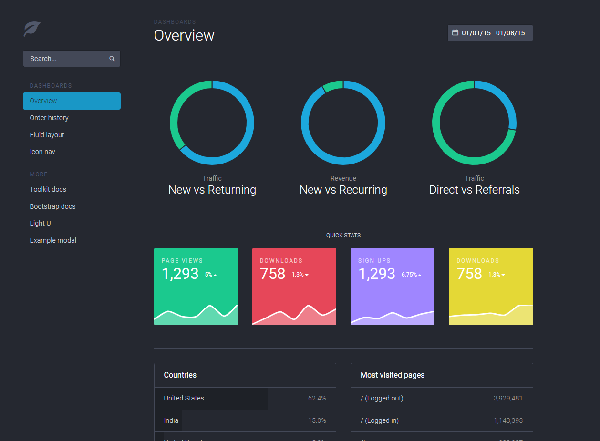
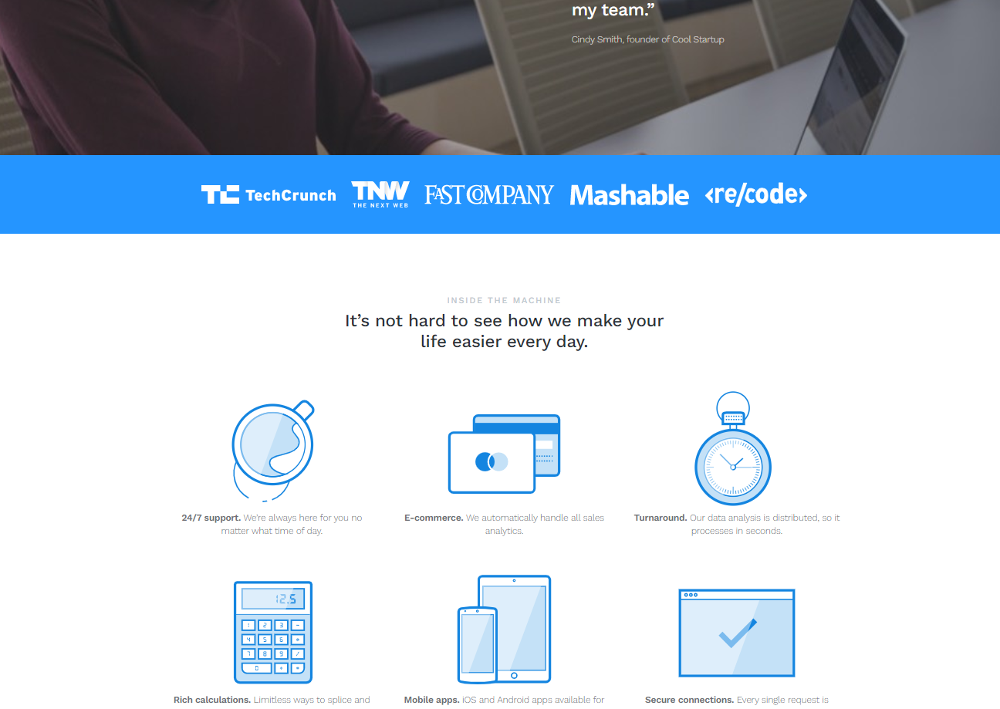
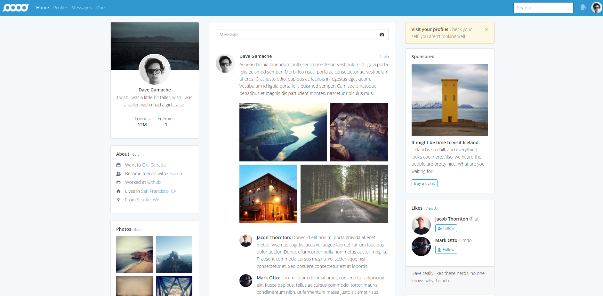

# Bootstrap Themes

#### Bootstrap has many purchasable themes on following site <a href="https://themes.getbootstrap.com/" target="_blank">Bootstrap Themes</a>
* Themes are designed for developers
* Themes are editable according to users preferences

#### The Udemy course <a href="https://www.udemy.com/certificate/UC-746ab2c2-ffdf-4834-9fe1-1e75ff33ea7a/" alt="_blank">"The Complete Web Developer Course 2.0"</a> provides three free themes.
* Dashboard theme
  
* Marketing theme
  
* Social media theme
  

### How to get themes ?
* Sign up to <a href="https://www.ecowebhosting.co.uk" target="_blank">Eco Webhosting</a> (free for the attendants/students of the course)
* Verify attendance of course by going <a href="https://www.ecowebhosting.co.uk/cp/webdev2" target="_blank">here</a>
* Scroll down in order to find and download archived (ZIPPed) themes
